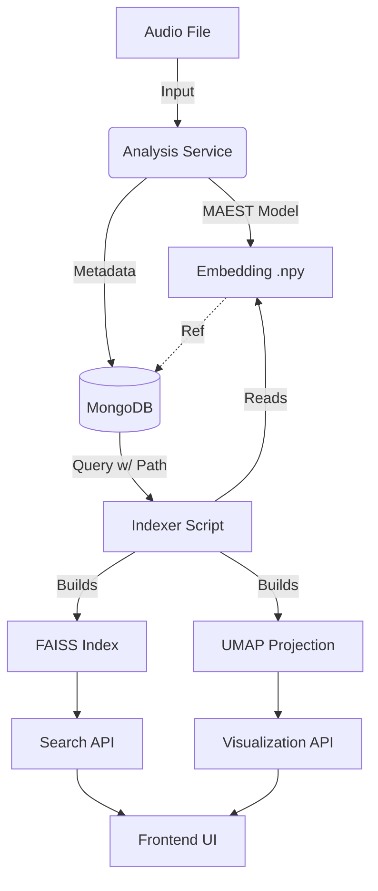

# Semantic Search & Analysis Architecture

## Overview
This feature adds **content-based audio retrieval** and **exploratory visualization** to the FERM Audio Analysis platform. By leveraging the embeddings generated by the MAEST model, we can enable user to:
1.  **Find Similar Tracks**: "Show me other tracks that sound like this one."
2.  **Explore the collection**: 2D Map (UMAP) of all analyzed tracks, clustering similar genres/styles.
3.  **Compute Novelty**: Identify tracks that are outliers in the collection.

## High Level Purpose of Demonstration 

The value of this feature for the viewers who contribute to the analysis collection is to provide a unique and fascinating demonstration of how their song is either different or similar to the rest of the collection, giving us a sort of 'novelty score'. This should be very enticing to all kinds of artists to continue to discover this platform and pursue a high novelty score while maintaining a high quality of production. Therefore, aside from the quality of the code and database, the primary point of focus should be to display this information in a way that is easy to understand and engaging for the user.

## Live Stream Mode

For real-time streaming workflows (e.g., "two similar songs in a row"), the system supports **dynamic FAISS updates**:

- **No rebuild required**: The index supports `add()` and `search()` operations incrementally.
- **Instant feedback**: New submissions can query for nearest neighbors immediately, then be added to the index for subsequent searches.
- **Checkpointing**: Instead of rebuilding, the index is saved periodically (every N tracks or on timer) to maintain crash-safety.

This enables a workflow where each artist submission is analyzed, matched against the collection, and instantly incorporated for the next artist—all without offline batch processing.

> [!NOTE]
> See [02-indexing-process.md](./02-indexing-process.md) for the preferred index types and live update patterns.

## Architecture

## Setup Status
*   **Embeddings**: Currently generated by `runMAEST` in `src/runners/maest.js` and orchestrated by `src/api/analysis-service.js`.
*   **Storage**: Paths are stored in `analysis_records` collection in MongoDB (`embeddingPath` field).
*   **Indexing**: *Pending Implementation*.
*   **Visualization**: *Pending Implementation*.

## Navigation
*   [01-data-pipeline.md](./01-data-pipeline.md) - Embedding generation, storage, and live stream ID mapping.
*   [02-indexing-process.md](./02-indexing-process.md) - FAISS indexing script and live stream update patterns.
*   [03-visualization.md](./03-visualization.md) - UMAP projection and Frontend integration.
